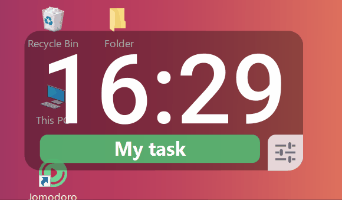
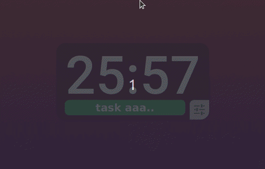

# Jomodoro

A simple and user-friendly Pomodoro helper 🍅

## Overview

Jomodoro is a simple timer which runs on screen. Its basically a simple timer that helps to keep focus on your current task by always staying on top of screen (in a less distractive manner). It aims to help you to be on the track of your 🍅 Pomodoro Routing.

Jomodoro is in its very early stages, so feedback and contributions are welcome and appreciated! 

## Features

- Stays on top of screen, but hides on mouse over
- Resizable, and Movable
- User can choose work & break times
- Shows current focusing task name 
- Charms & flashes screen when timer finish
<br>

Demo on Windows 10:



Demo on Ubuntu 20.04:




## Checklist 

- [x] On Screen Timer 
- [ ] Tray Menu
- [ ] User Prefereces 
- [ ] User Statistics 
- [ ] Day Planing
- [ ] Desktop notifications

## Install [](https://github.com/tharindusathis/jomodoro/releases)

Currently available for,
- [x] Windows
- [ ] Linux
- [ ] MacOS 


Download the latest version from the [releases](https://github.com/tharindusathis/jomodoro/releases) page.

**Note:** Jomodoro is not signed yet. So, you will get a warning like "Unknown Publisher" when installing.

### Running from source

To run Jomodoro from source you will need Maven. Clone the repo and run,
```
mvn clean
mvn package
mvn exec:java
```

## Development

Built with JavaFX.

## Credits

### Fonts

This app uses [Roboto](https://fonts.google.com/specimen/Roboto) font licensed under the [Apache License, Version 2.0](http://www.apache.org/licenses/LICENSE-2.0).


